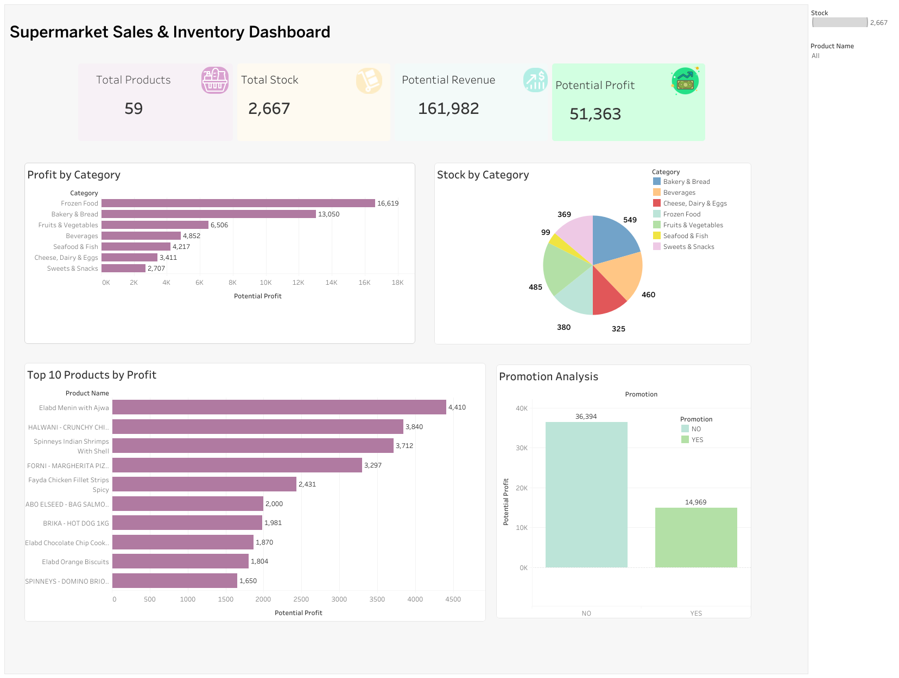

# Spinneys Data Entry & Sales Analysis

## Project Overview

This project started as a product data entry task using product information collected from the Spinneys website.

The data was entered and organized in Microsoft Excel, then prepared for analysis and transformed into an interactive Tableau dashboard to analyze product inventory, profitability, revenue potential, profit margins, categories, and promotions.

The project demonstrates an end-to-end data workflow from data entry and preparation to analysis, visualization, and business insights.

---

## Data Entry

The project began with collecting and entering product information from the Spinneys website into an Excel dataset.

The dataset contains 59 products with the following information:

- Product ID
- Category
- Vendor / Brand
- Product Name
- Size
- Cost
- Selling Price
- Promotion
- Stock

The data was organized and prepared in Excel before being used for further analysis.

---

## Data Preparation & Calculated Fields

Additional calculated fields were created to support the analysis.

### Profit

Profit = Selling Price - Cost

### Profit Margin

Profit Margin = Profit / Selling Price

### Stock Value

Stock Value = Cost × Stock

### Potential Revenue

Potential Revenue = Selling Price × Stock

### Potential Profit

Potential Profit = Profit × Stock

---

## Tools Used

- **Microsoft Excel** — Data Entry & Data Preparation
- **Tableau Public** — Data Analysis & Interactive Visualization
- **GitHub** — Project Documentation & Version Control

---

## Tableau Dashboard

The interactive Tableau dashboard analyzes product performance, inventory, profitability, revenue potential, profit margins, categories, and promotions.

### Dashboard Preview



### View Interactive Dashboard

[View the Interactive Tableau Dashboard](https://public.tableau.com/app/profile/aya.ali4011/vizzes)

---

## Key KPIs

| KPI | Value |
|---|---:|
| Total Products | 59 |
| Total Stock | 2,667 |
| Potential Revenue | EGP 161,982 |
| Potential Profit | EGP 51,363 |

---

## Dashboard Analysis

The dashboard includes:

- Product Inventory Analysis
- Stock Distribution by Category
- Potential Revenue by Category
- Potential Profit by Category
- Top 10 Products by Potential Profit
- Low / Zero Stock Products
- Profit Margin Analysis
- Promotion Analysis
- Interactive Category Filter

---

## Key Business Insights

- **Frozen Food** generated the highest potential profit among all categories, at approximately **EGP 16.6K**.
- **Bakery & Bread** had the highest stock quantity with **549 units**.
- Products without promotions represented **41 products**, while **18 products** were promoted.
- The **Top 10 Products** generated approximately **EGP 26.99K** in potential profit.
- **Four products** currently have zero stock, indicating potential inventory replenishment opportunities.
- Profit margins varied significantly across products, with the highest margin reaching approximately **63.5%**.
- Total inventory represents approximately **EGP 110.6K in stock value**.
- If all available inventory were sold at the current selling prices, it could generate approximately **EGP 162K in potential revenue**.

---

## Project Files

### Excel Dataset

`data/Spinneys_Product_Data.xlsx`

Contains the entered and prepared product dataset, including cost, selling price, promotion status, stock, and calculated fields.

### Tableau Workbook

`tableau/Spinneys_Sales_Inventory_Dashboard.twbx`

Contains the interactive Tableau dashboard and visual analysis.

### Dashboard Screenshot

`screenshots/dashboard.png`

Preview of the final Tableau dashboard.

---

## Project Workflow

```text
Spinneys Website
       ↓
Data Collection & Data Entry
       ↓
Microsoft Excel
       ↓
Data Preparation & Calculated Fields
       ↓
Tableau
       ↓
Interactive Dashboard
       ↓
Business Insights
